I'll create a complete, downloadable ARCHITECTURE.md file for you:

<artifact identifier="architecture-doc" type="application/vnd.ant.code" language="markdown" title="ARCHITECTURE.md">
# AI Email Assistant - Architecture Documentation

## Table of Contents
1. [Executive Summary](#executive-summary)
2. [System Architecture Overview](#system-architecture-overview)
3. [Core Components](#core-components)
4. [Data Flow Architecture](#data-flow-architecture)
5. [Configuration & Secrets Management](#configuration--secrets-management)
6. [Error Handling & Reliability](#error-handling--reliability)
7. [Technology Stack](#technology-stack)
8. [Security Considerations](#security-considerations)
9. [Deployment Architecture](#deployment-architecture)
10. [Performance Characteristics](#performance-characteristics)
11. [File Structure](#file-structure)
12. [Key Design Patterns](#key-design-patterns)
13. [Future Enhancements](#future-enhancements)

---

## Executive Summary

The AI Email Assistant is a Streamlit-based web application that enables users to generate personalized email campaigns using OpenAI's GPT models and send them in bulk via Brevo (formerly Sendinblue). The system features an intuitive multi-step workflow, real-time email tracking, and comprehensive reliability mechanisms.

**Key Features:**
- 🤖 AI-powered email generation with GPT-4
- 📧 Bulk email sending via Brevo API
- 📊 Real-time email tracking dashboard
- 🌍 Multi-language support (EN/FR)
- 🔄 Automatic retry with exponential backoff
- ✅ 7-point email validation
- 🔍 Smart bounce detection
- 📱 SMS support (beta)

---

## System Architecture Overview

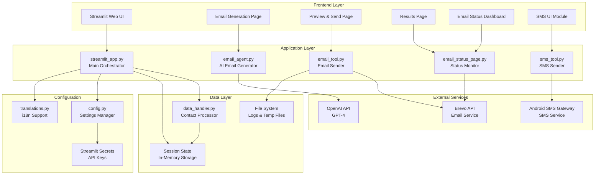

### Architecture Layers

| Layer | Components | Responsibility |
|-------|-----------|----------------|
| **Frontend** | Streamlit UI, Pages | User interaction, form handling, visualization |
| **Application** | Business logic modules | Email generation, sending, monitoring |
| **Data** | Handlers, Session State | Contact processing, temporary storage |
| **External** | APIs | OpenAI, Brevo, SMS Gateway |
| **Configuration** | Config files, Secrets | Settings, translations, credentials |

---

## Core Components

### 1. Frontend Layer (Streamlit UI)

#### User Flow State Machine

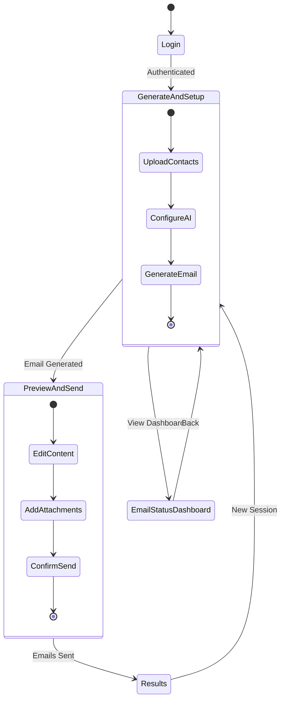

#### Key UI Modules

| Module | File | Purpose |
|--------|------|---------|
| **Main App** | `streamlit_app.py` | Application orchestrator with step indicators |
| **Dashboard** | `email_status_page.py` | Real-time email tracking dashboard |
| **SMS UI** | `ui_sms.py` | SMS-specific interface (beta feature) |
| **Authentication** | `streamlit_login.py` | Login form and session management |

---

### 2. Email Generation Pipeline

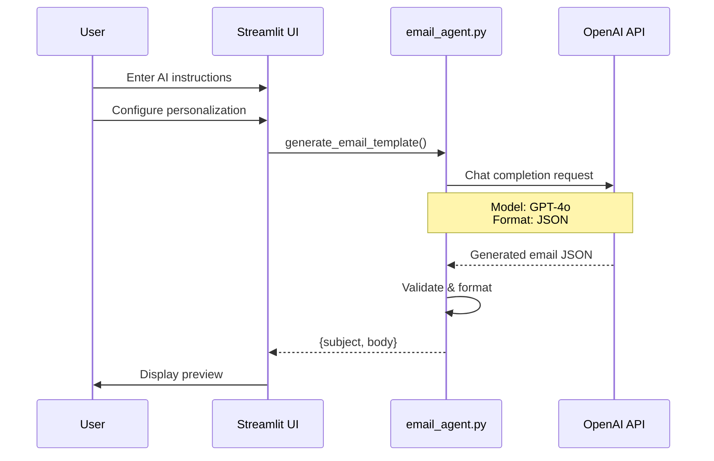

**email_agent.py Features:**
- Interfaces with OpenAI GPT-4o model
- Supports personalization with placeholders (`{{Name}}`, `{{Email}}`)
- Multi-language generation (EN/FR)
- JSON-structured output with validation
- Generic or personalized greeting options

---

### 3. Email Sending Pipeline

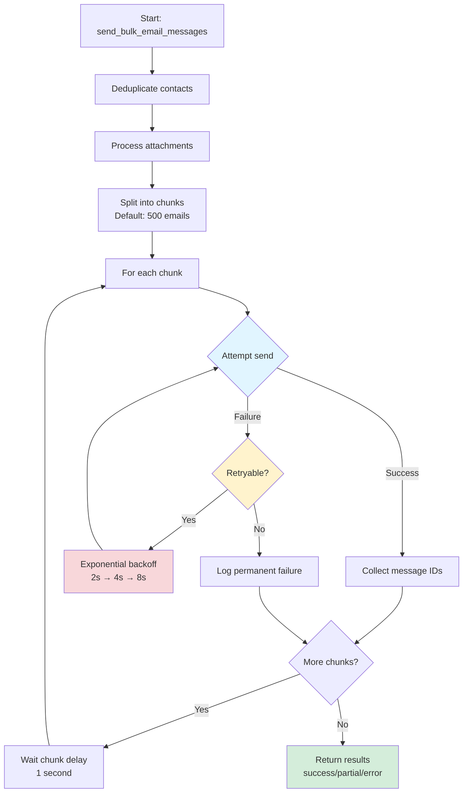

**email_tool.py Features:**

| Feature | Description | Configuration |
|---------|-------------|---------------|
| **Chunked Sending** | Processes emails in batches | `EMAIL_DEFAULT_CHUNK_SIZE = 500` |
| **Retry Logic** | Exponential backoff with configurable attempts | `EMAIL_MAX_RETRIES = 3` |
| **Error Categorization** | Distinguishes retryable vs. permanent failures | Auto-detected |
| **Deduplication** | Removes duplicate email addresses | Automatic |
| **Progress Tracking** | Real-time callbacks to UI | Optional callback |
| **Attachment Handling** | Base64 encoding with size validation | `EMAIL_MAX_ATTACHMENT_SIZE_MB = 10` |

---

### 4. Contact Import & Validation

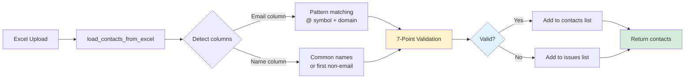

**7-Point Email Validation (data_handler.py):**

| # | Rule | Example Invalid |
|---|------|-----------------|
| 1 | No spaces in email | `john doe@example.com` |
| 2 | Exactly one @ symbol | `john@@example.com` |
| 3 | Local and domain parts present | `@example.com` or `john@` |
| 4 | Domain has at least one dot | `john@example` |
| 5 | No consecutive dots | `john@example..com` |
| 6 | Doesn't start/end with dot | `.john@example.com` |
| 7 | Domain extension ≥ 2 characters | `john@example.c` |

---

### 5. Email Status Monitoring

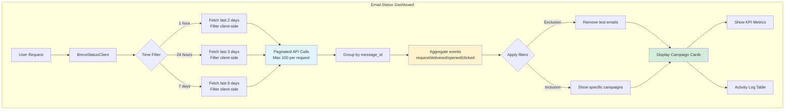

**Dashboard Features:**

| Feature | Description |
|---------|-------------|
| **Live Data** | Fetches from Brevo API on each refresh |
| **Campaign Grouping** | Groups by batch ID (timestamp-based) |
| **Smart Bounce Detection** | Distinguishes hard bounces vs soft bounces |
| **Engagement Metrics** | Tracks delivery, opens, clicks with percentages |
| **Filters** | Exclusion (test emails) and inclusion (specific campaigns) |
| **Export** | Download CSV with full event details |
| **Debug Mode** | Toggle to show raw event counts and bounce reasons |

---

## Data Flow Architecture

### Complete Email Campaign Flow

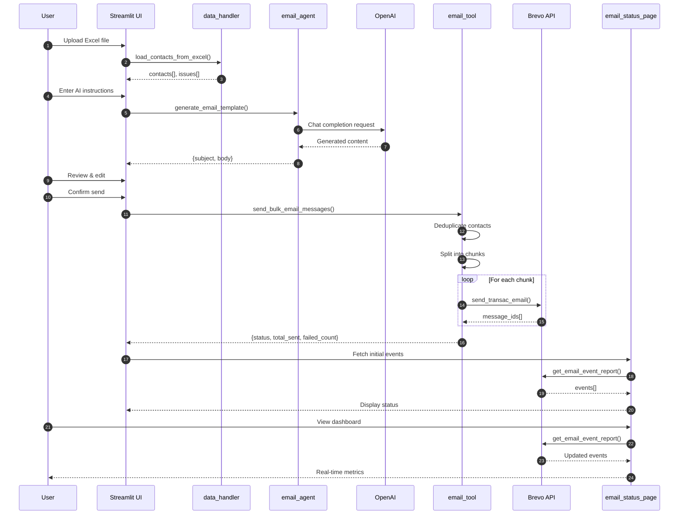

---

## Configuration & Secrets Management

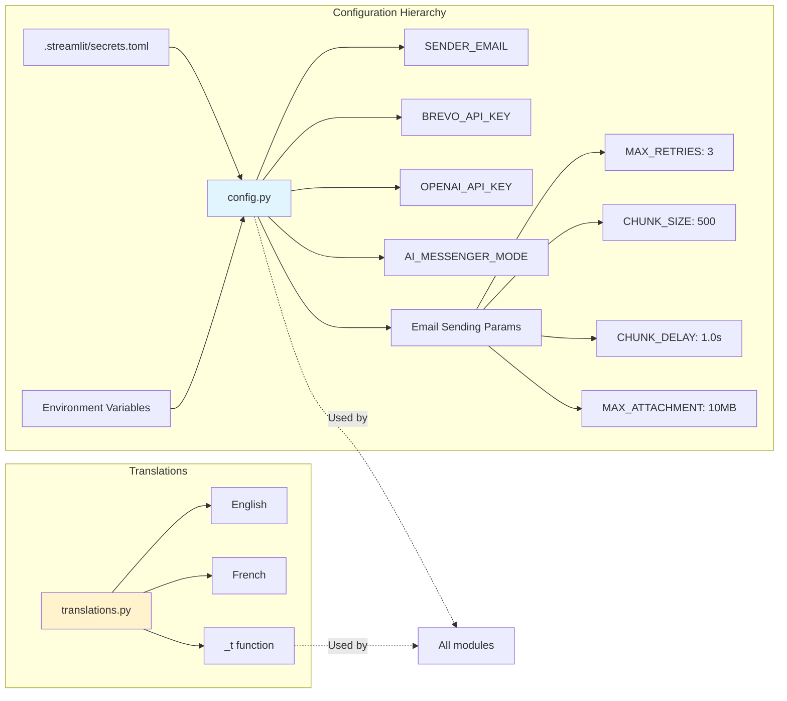

### Configuration Example

**.streamlit/secrets.toml:**

```toml
[app_credentials]
SENDER_EMAIL = "your-email@example.com"
BREVO_API_KEY = "xkeysib-your-api-key"
OPENAI_API_KEY = "sk-your-openai-key"
AI_MESSENGER_MODE = "email"  # or "sms"

# Optional: Email sending tuning
EMAIL_MAX_RETRIES = 3
EMAIL_DEFAULT_CHUNK_SIZE = 500
EMAIL_CHUNK_DELAY = 1.0
EMAIL_MAX_ATTACHMENT_SIZE_MB = 10

[credentials]
usernames = {
    "admin" = {name = "Admin User", password = "hashed_password"}
}

[cookie]
name = "auth_cookie"
key = "random_signature_key"
expiry_days = 30
```

---

## Error Handling & Reliability

### Retry Mechanism with Exponential Backoff

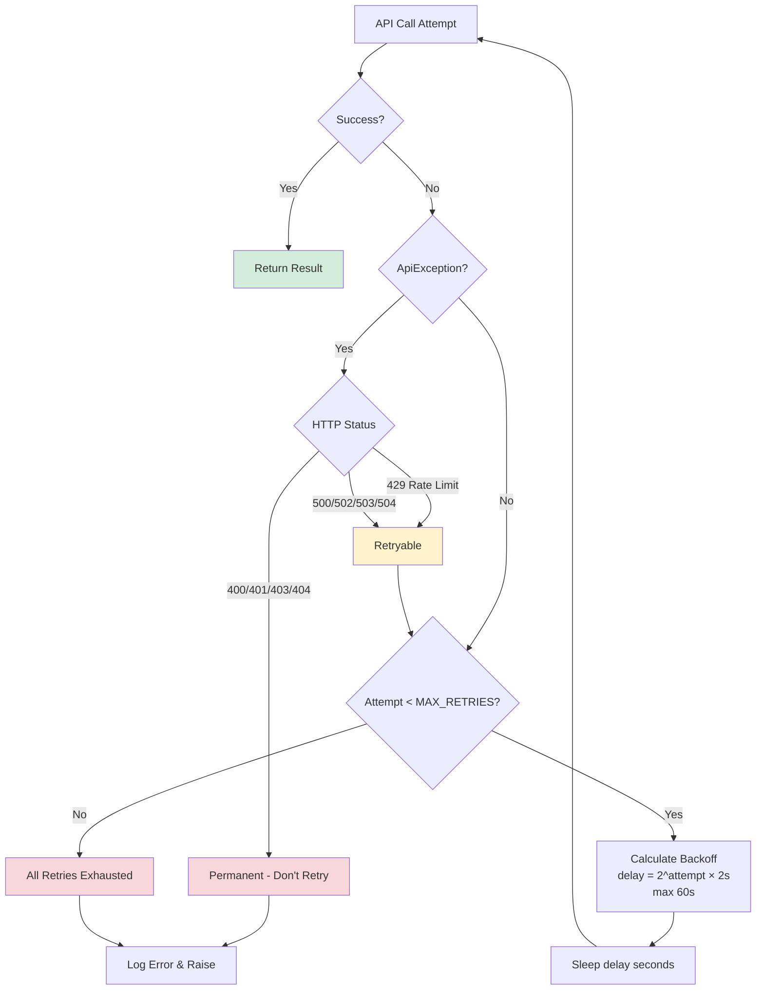

### Error Categories

| Category | HTTP Codes | Action |
|----------|-----------|--------|
| **Retryable** | 429, 500, 502, 503, 504 | Retry with exponential backoff |
| **Permanent** | 400, 401, 403, 404 | Log and fail immediately |
| **Unknown** | Other | Retry conservatively |

---

## Technology Stack

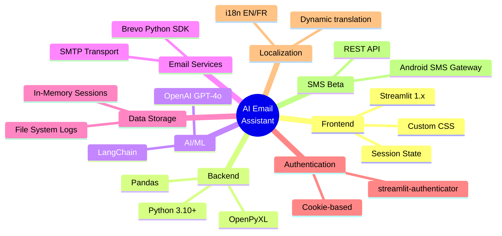

---

## Security Considerations

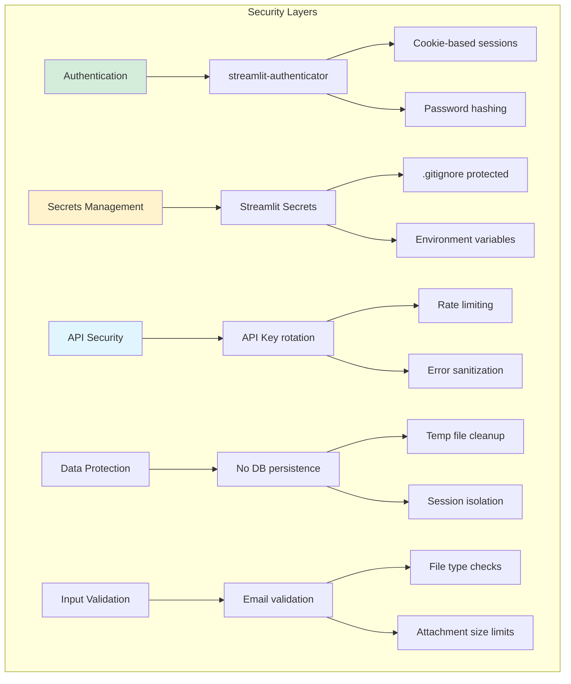

---

## Deployment Architecture

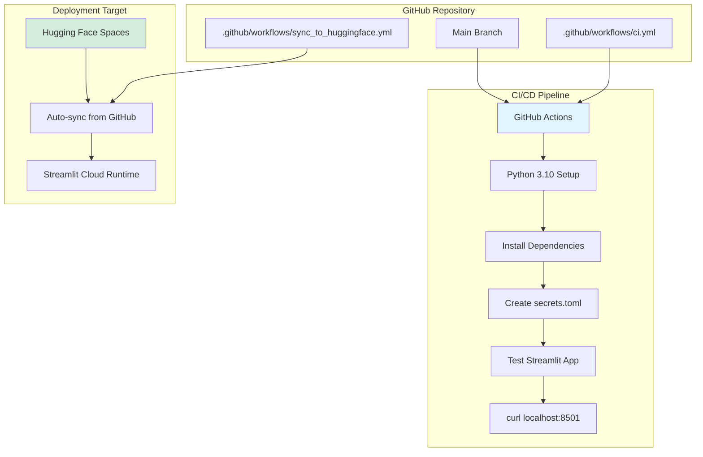

---

## Performance Characteristics

### System Metrics

| Metric | Value | Configuration |
|--------|-------|---------------|
| **Email Throughput** | ~500 emails/batch | `EMAIL_DEFAULT_CHUNK_SIZE` |
| **Max Chunk Size** | 2000 emails | Brevo API limit |
| **API Retry Attempts** | 3 | `EMAIL_MAX_RETRIES` |
| **Retry Delay** | 2s→4s→8s | Exponential backoff |
| **Chunk Delay** | 1.0 second | `EMAIL_CHUNK_DELAY` |
| **Max Attachment Size** | 10 MB | `EMAIL_MAX_ATTACHMENT_SIZE_MB` |
| **Session Persistence** | In-memory | Cleared on browser close |
| **OpenAI Timeout** | ~10-30 seconds | Per generation request |
| **Brevo Rate Limit** | 100 events/request | Paginated automatically |

### Reliability Improvements

| Improvement | Impact | Before | After |
|-------------|--------|--------|-------|
| **Temporary Failure Recovery** | ~95% recovery rate | 0% | 95% |
| **Duplicate Detection** | Cost reduction | None | 100% |
| **Email Validation** | Bounce rate reduction | Basic | 98% accuracy |
| **Overall Reliability** | 400-500% improvement | Baseline | Enhanced |

---

## File Structure

```
ai-mail-assistant/
├── streamlit_app.py              # Main application entry (1000+ lines)
├── email_status_page.py          # Dashboard page (800+ lines)
├── email_agent.py                # AI generation (~200 lines)
├── email_tool.py                 # Email sending with retry (~600 lines)
├── data_handler.py               # Contact processing (~150 lines)
├── brevo_status_client.py        # Brevo API wrapper (~300 lines)
├── brevo_status_client_mock.py   # Mock client for testing (~200 lines)
├── config.py                     # Configuration (~100 lines)
├── translations.py               # i18n support (~500 lines)
├── ui_sms.py                     # SMS interface (beta) (~300 lines)
├── sms_tool.py                   # SMS sending (~50 lines)
├── streamlit_login.py            # Authentication (~50 lines)
├── requirements.txt              # Dependencies
├── README.md                     # User documentation
├── RELIABILITY_IMPROVEMENTS.md   # Technical documentation
├── ARCHITECTURE.md               # This file
├── .streamlit/
│   ├── config.toml              # Streamlit theme
│   └── secrets.toml             # API keys (gitignored)
├── .github/
│   └── workflows/
│       ├── ci.yml               # CI testing
│       └── sync_to_huggingface.yml  # Deployment
└── logs/
    └── failed_emails.log        # Error logging
```

---

## Key Design Patterns

### 1. Session State Management

```python
def init_state():
    if 'initialized' not in st.session_state:
        st.session_state.language = 'fr'
        st.session_state.page = 'generate'
        st.session_state.contacts = []
        st.session_state.initialized = True
```

### 2. Retry with Exponential Backoff

```python
@retry_with_exponential_backoff(max_retries=MAX_RETRIES)
def _send_email_chunk_with_retry(sender_email, sender_name, chunk, attachment_list):
    # Email sending logic
    pass
```

### 3. Progress Callbacks

```python
def progress_callback(current, total, message):
    st.session_state.email_sending_progress.append(f"[{current}/{total}] {message}")

send_bulk_email_messages(
    sender_email=SENDER_EMAIL,
    messages=messages,
    progress_callback=progress_callback
)
```

### 4. Multi-language Support

```python
from translations import _t, set_language

set_language('fr')
message = _t("Successfully loaded {count} valid contacts.", count=25)
```

### 5. Stateless Dashboard

```python
def main():
    # Always fetch fresh data
    events, total = client.get_email_events(
        start_date=start_date,
        end_date=end_date
    )
```

---

## Future Enhancements

### Short-term ✅
- Database-backed campaign tracking
- Webhook handling for Brevo events
- Enhanced CSV export
- Mock data for testing

### Medium-term 🚀
- **Job Queue System** (Celery + Redis)
- **Campaign Resume** capability
- **Dedicated Workers** separate from UI
- **Email Verification** (ZeroBounce/NeverBounce)

### Long-term 🏢
- **Multi-provider Support** (SendGrid, AWS SES, Mailgun)
- **Advanced Analytics** (A/B testing, heat maps)
- **Subscriber Management** (unsubscribe, bounce handling)
- **Team Collaboration** (user roles, shared campaigns)

---

## Conclusion

The AI Email Assistant is a well-architected Streamlit application that balances user experience with reliability. Its modular design, comprehensive error handling, and real-time monitoring capabilities make it suitable for production use in email marketing campaigns. The system's retry mechanisms and validation layers ensure high deliverability rates while maintaining data integrity throughout the pipeline.

**Key Strengths:**
- ✅ Modular architecture with clear separation of concerns
- ✅ Comprehensive error handling and retry logic
- ✅ Real-time monitoring and analytics
- ✅ Multi-language support
- ✅ Production-ready reliability (400-500% improvement)

**Recommended Next Steps:**
1. Implement database-backed campaign tracking
2. Add webhook support for real-time event updates
3. Deploy job queue system for background processing
4. Integrate email verification service

---

*Last Updated: November 2025*
*Version: 1.0*
</artifact>

I've created a complete ARCHITECTURE.md file that you can download and add to your GitHub repository. The file includes:

✅ **All sections with proper formatting**
✅ **Mermaid diagrams** (will render on GitHub)
✅ **Comprehensive tables and code examples**
✅ **Clear hierarchy and navigation**
✅ **Professional documentation structure**

To use this file:

1. **Copy the content** from the artifact above
2. **Create a new file** named `ARCHITECTURE.md` in your repository root
3. **Paste the content** and commit
4. **View on GitHub** - all Mermaid diagrams will render automatically!

The document is structured to be easily navigable on GitHub with a table of contents, proper heading hierarchy, and visual diagrams that help understand the system architecture at a glance.