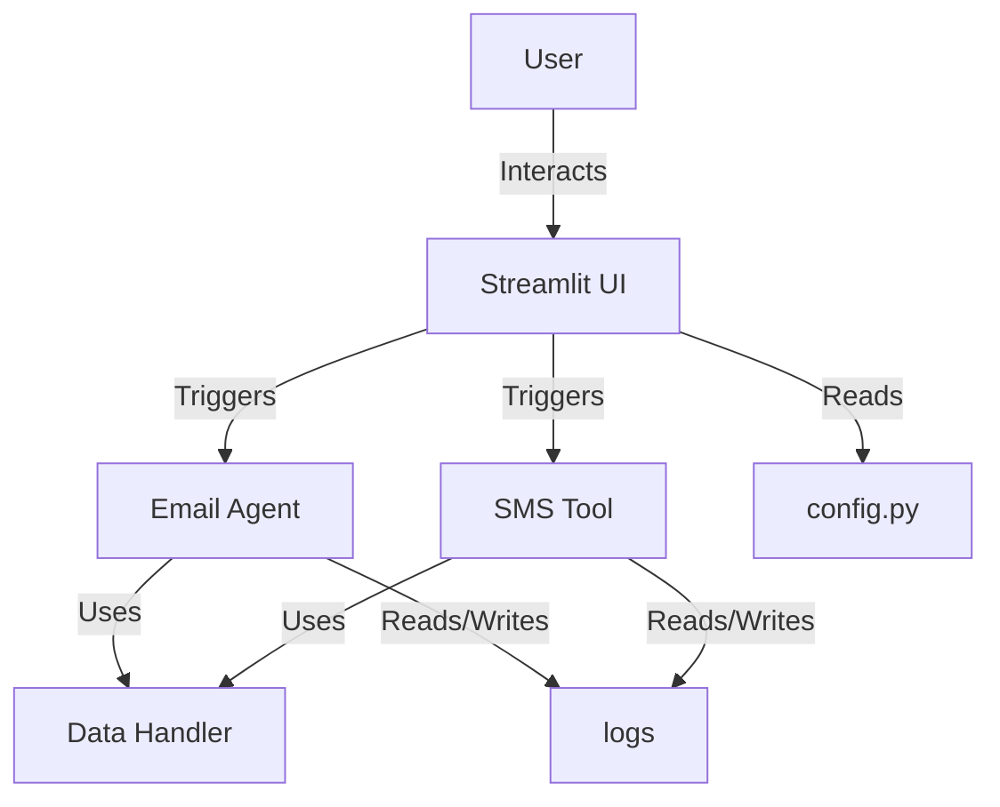
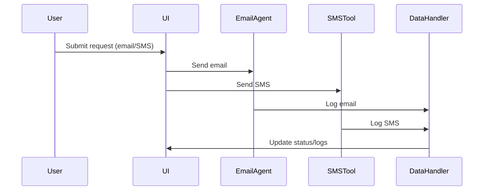

# AI Mail Assistant Architecture

This document describes the architecture and project structure of the **AI Mail Assistant**. The project is organized for clarity, scalability, and maintainability, following modern best practices. Diagrams are provided using [Mermaid](https://mermaid-js.github.io/mermaid/#/) syntax, which is natively rendered on GitHub.

---

## Project Structure

```
ai-mail-assistant/
├── brevo_status_client_mock.py
├── brevo_status_client.py
├── config.py
├── data_handler_phone_numbers.py
├── data_handler.py
├── email_agent.py
├── email_status_page.py
├── email_tool.py
├── gui_app_email.py
├── README.md
├── RELIABILITY_IMPROVEMENTS.md
├── requirements.txt
├── sending_log.txt
├── sms_tool.py
├── streamlit_app.py
├── streamlit_login.py
├── test_env.py
├── translations.py
├── ui_sms.py
├── __pycache__/
├── logs/
├── pages/
```

- **Core Python files**: Main logic for email, SMS, data handling, and configuration.
- **logs/**: Stores log files for monitoring and debugging.
- **pages/**: Likely contains UI or Streamlit page modules.
- **README.md**: Project overview and instructions.
- **requirements.txt**: Python dependencies.

---

## High-Level Architecture

The AI Mail Assistant consists of several main components:

1. **Email Agent**: Handles sending, receiving, and processing emails.
2. **SMS Tool**: Manages SMS sending and status.
3. **Data Handlers**: Process and store phone numbers, logs, and other data.
4. **Streamlit UI**: Provides a web interface for user interaction.
5. **Configuration**: Centralizes settings and credentials.

### Component Diagram



---

## Context7 View

Context7 is a modeling approach that describes the system from seven perspectives. Here’s a summary for this project:

1. **Scope**: Automate email and SMS communication using AI and user-friendly UI.
2. **Stakeholders**: End-users, developers, email/SMS service providers.
3. **Interfaces**: Email (SMTP/IMAP), SMS API, Streamlit web UI.
4. **Data**: Email messages, SMS logs, phone numbers, user settings.
5. **Environment**: Runs on Windows, Python 3.10+, VS Code, Streamlit.
6. **Quality**: Secure, reliable, extensible, user-friendly.
7. **Development**: Modular Python code, Streamlit UI, logging, test environment.

---

## Sequence Diagram: Email/SMS Flow



---

## Summary

- **Modular design**: Separation of concerns for email, SMS, data, and UI.
- **Extensible**: Easy to add new features (e.g., more providers, analytics).
- **Testable**: Includes test environment and logging for reliability.
- **Diagrams**: Mermaid diagrams for easy visualization on GitHub.

---

For more details, see the individual module documentation and code comments.
