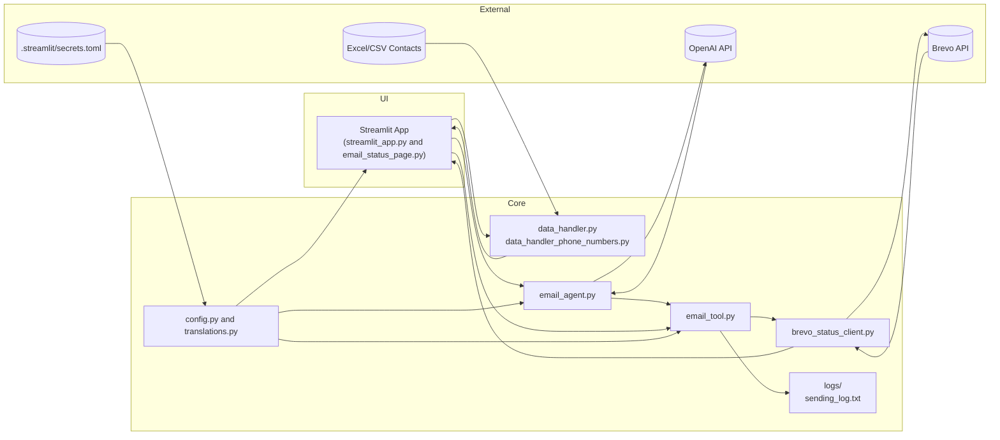

# AI Mail Assistant

Smart Email Messenger is an AI-powered tool that helps you create, personalize, and send professional emails at scale — fast, friendly, and effortlessly.

## Features

### 📧 Email Campaign Management
- **AI-Powered Generation**: Create professional email content using OpenAI
- **Bulk Sending**: Send to multiple recipients with Brevo (Sendinblue)
- **Personalization**: Dynamic placeholders for personalized content
- **Attachments**: Support for file attachments
- **Custom Buttons**: Add custom CTA buttons with configurable colors
- **Multi-language Support**: English and French translations
- **Email Validation**: Enhanced 7-point validation system
- **Duplicate Detection**: Automatically removes duplicate email addresses
- **Automatic Retry Logic**: Recovers from temporary API failures automatically

### 📊 Email Status Dashboard
A real-time monitoring page that displays the latest sent email activity from Brevo:

- **Live Data Fetching**: Stateless pulls from Brevo API on each refresh
- **Summary Metrics**: View delivery rates, open rates, and click rates
- **Batch Grouping**: Groups emails by send batch for easier tracking
- **Event Details**: Expandable rows with full event information per recipient
- **CSV Export**: Download detailed reports of email activity
- **Pagination**: Navigate through large result sets
- **Color-Coded Status**: Visual indicators for different delivery states

## Installation

1. Clone the repository:
```bash
git clone https://github.com/AI-Freelancerz/ai-mail-assistant.git
cd ai-mail-assistant
```

2. Install dependencies:
```bash
pip install -r requirements.txt
```

3. Configure secrets in `.streamlit/secrets.toml`:
```toml
# Brevo (Sendinblue) Configuration
BREVO_API_KEY = "your-brevo-api-key"
SENDER_EMAIL = "your-sender@example.com"

# OpenAI Configuration
OPENAI_API_KEY = "your-openai-api-key"

# Application Mode (optional)
AI_MESSENGER_MODE = "email"  # or "sms"

# Optional: Email sending tuning (defaults work well!)
EMAIL_MAX_RETRIES = 3
EMAIL_DEFAULT_CHUNK_SIZE = 500
EMAIL_CHUNK_DELAY = 1.0
```

## Usage

### Running the Application

```bash
streamlit run streamlit_app.py
```

The application will start on `http://localhost:8501`

### Main Email Campaign Flow

1. **Generation & Setup**
   - Upload Excel file with contacts (columns: name, email)
   - Provide AI instructions for email generation
   - Optional: Add context, enable personalization, configure custom buttons
   - Generate email template

2. **Preview & Send**
   - Review and edit the generated email
   - See live preview for first contact
   - Add attachments if needed
   - Confirm and send

3. **Results**
   - View sending summary (success/failed counts)
   - Check individual email statuses
   - Review activity log and errors
   - Refresh event status for specific emails

### Email Status Dashboard

Access the dashboard via the sidebar navigation: **Email Status Dashboard**

**Key Features:**
- **Summary Metrics**: View totals for recipients, delivery, opens, clicks, and bounces with percentage rates
- **Detailed View**: See emails grouped by batch with expandable details for individual recipients
- **Download Report**: Export email status data to CSV with full event details
- **Refresh Button**: Manually refresh data from Brevo API

## Project Structure

```
ai-mail-assistant/
├── streamlit_app.py              # Main application entry point
├── email_status_page.py          # Email status dashboard page
├── brevo_status_client.py        # Brevo API client wrapper
├── email_tool.py                 # Email sending utilities
├── email_agent.py                # AI email generation agent
├── data_handler.py               # Excel contact processing
├── translations.py               # Multi-language support
├── config.py                     # Configuration management
├── requirements.txt              # Python dependencies
    └── .streamlit/
        └── secrets.toml              # Secret configuration (not in repo)
```

## Architecture Overview

### High-Level Diagram



### Component Roles and Interactions

- **Streamlit UI (streamlit_app.py & email_status_page.py)**: Central interaction layer where campaign configuration, AI generation prompts, sending actions, and status monitoring occur. It orchestrates calls into the rest of the system and renders results back to the user.
- **Data Handlers (data_handler.py & data_handler_phone_numbers.py)**: Validate and normalize uploaded Excel/CSV contact data for email and SMS campaigns, ensuring downstream modules work with consistent structures.
- **AI Generation (email_agent.py)**: Produces personalized email copy by combining user prompts, translations, and configuration, then relaying structured requests to the OpenAI API.
- **Email Operations (email_tool.py)**: Prepares batched payloads, handles attachments, applies retry logic, and records send outcomes while collaborating with the Brevo client.
- **Brevo Client (brevo_status_client.py)**: Wraps Brevo’s transactional email and reporting APIs. It sends payloads from `email_tool.py` and retrieves delivery/open/click events for the dashboard.
- **Configuration & Localization (config.py, translations.py, .streamlit/secrets.toml)**: Supply runtime settings, localization strings, and secrets such as API keys so that UI and backend modules stay environment-agnostic.
- **Logging (logs/, sending_log.txt, failed_emails.log)**: Persist sending outcomes, retries, and errors. These artifacts feed the dashboard and help operators diagnose issues.
- **External Services (Brevo API & OpenAI API)**: Provide email delivery infrastructure and AI text generation, respectively. The application keeps these interactions stateless and retry-aware to ensure reliability.
- **User Data Inputs (Excel/CSV Contacts)**: Serve as the source of recipient metadata for personalization; processed by the data handlers before feeding the AI generation and email sending flows.

## API Integration

### Brevo (Sendinblue) API

The application uses Brevo's transactional email API for:
- Sending individual and bulk emails
- Fetching email event reports (delivered, opened, clicked, etc.)
- Retrieving detailed email content

**Rate Limiting**: The client includes automatic retry with exponential backoff for rate-limited requests (429 errors).

### OpenAI API

Used for AI-powered email content generation with customizable:
- Tone and style
- Personalization options
- Language selection

## Configuration Presets

### Balanced (Default)
Already configured - no changes needed!

### Fast Mode (Newsletters)
```toml
EMAIL_DEFAULT_CHUNK_SIZE = 1000
EMAIL_CHUNK_DELAY = 0.5
```

### Maximum Reliability (Critical)
```toml
EMAIL_DEFAULT_CHUNK_SIZE = 100
EMAIL_CHUNK_DELAY = 2.0
EMAIL_MAX_RETRIES = 5
```

## Development

### Adding New Translations

Edit `translations.py` and add entries to both `"en"` and `"fr"` dictionaries:

```python
TRANSLATIONS = {
    "en": {
        "Your Key": "Your English Text",
        # ...
    },
    "fr": {
        "Your Key": "Votre Texte Français",
        # ...
    }
}
```

Use in code: `_t("Your Key")`

### Event Types

Supported Brevo event types:
- `request`: Email request received
- `delivered`: Successfully delivered
- `opened`: Recipient opened email
- `clicks`: Recipient clicked link
- `hardBounces`: Permanent delivery failure
- `softBounces`: Temporary delivery failure
- `blocked`: Email blocked
- `spam`: Marked as spam
- `deferred`: Temporarily deferred
- `unsubscribed`: Recipient unsubscribed
- `error`: General error

## Troubleshooting

### Email Status Dashboard Issues

**Problem**: "Brevo API key not found in secrets"
- **Solution**: Ensure `.streamlit/secrets.toml` contains `BREVO_API_KEY = "..."`

**Problem**: No events showing up
- **Solution**: 
  - Check that emails have been sent through Brevo
  - The dashboard shows events from the last hour by default
  - Verify API key has read permissions

**Problem**: Rate limit errors (429)
- **Solution**: The client automatically retries with backoff. If persistent, reduce the frequency of refresh operations.

### General Issues

**Problem**: Import errors for `brevo_python`
- **Solution**: Run `pip install brevo-python` or `pip install -r requirements.txt`

## Testing at Scale

### Mock Data for Testing (100+ Emails)

To test the email status dashboard with large volumes of data without using your Brevo API quota or sending real emails, use the included mock client:

#### Quick Start

1. In `email_status_page.py`, find line 14:
   ```python
   from brevo_status_client import BrevoStatusClient
   ```

2. Replace it with:
   ```python
   from brevo_status_client_mock import MockBrevoStatusClient as BrevoStatusClient
   ```

3. Run the app:
   ```bash
   streamlit run streamlit_app.py
   ```

4. **Remember to change it back when done testing!**

#### What the Mock Generates

The mock client (`brevo_status_client_mock.py`) generates realistic test data:

- **100+ email events** across multiple campaigns
- **Realistic event types**: request, delivered, opened, clicked, bounced, spam, etc.
- **Multiple batches**: Simulates 3-8 different email campaigns
- **Event lifecycle**: Most emails follow realistic patterns (request → delivered → opened → clicked)
- **Time distribution**: Events spread across your selected time range
- **Proper message IDs**: Formatted like real Brevo message IDs
- **Realistic statistics**: ~90% delivery rate, ~60% open rate, ~40% click rate

#### Testing Scenarios

1. **Different Time Ranges**: Select different time filters and verify statistics change
2. **Filtering**: Test exclusion/inclusion filters
3. **Campaign View**: Click on different campaigns and verify details
4. **Performance**: Test UI responsiveness with 100+ events

#### Benefits of Mock Testing

✅ **No API quota usage** - unlimited testing  
✅ **No real emails sent** - safe for testing  
✅ **Instant data generation** - no waiting  
✅ **Consistent results** - predictable data  
✅ **Easy to reset** - just refresh the page  
✅ **Test edge cases** - includes bounces, spam, errors  

#### Advanced: Environment Variable Toggle

For easier switching between real and mock data, modify `email_status_page.py` around line 406:

```python
try:
    # Check if we should use mock data for testing
    use_mock = os.getenv("USE_MOCK_DATA", "false").lower() == "true"
    
    if use_mock:
        from brevo_status_client_mock import MockBrevoStatusClient
        client = MockBrevoStatusClient(BREVO_API_KEY)
        st.info("🧪 Using mock data for testing")
    else:
        client = BrevoStatusClient(BREVO_API_KEY)
except Exception as e:
```

Then run with mock data:
```bash
# Windows PowerShell
$env:USE_MOCK_DATA="true"
streamlit run streamlit_app.py

# Windows CMD
set USE_MOCK_DATA=true
streamlit run streamlit_app.py

# Linux/Mac
USE_MOCK_DATA=true streamlit run streamlit_app.py
```

## Monitoring

- **Application logs**: Console output with `[EMAIL_TOOL]` prefix
- **Failed emails**: `logs/failed_emails.log`
- **Progress tracking**: Real-time updates in UI

## Requirements

- Python 3.8+
- Streamlit
- OpenAI API key
- Brevo (formerly Sendinblue) API key

## Contributing

Contributions are welcome! Please:
1. Fork the repository
2. Create a feature branch
3. Make your changes
4. Submit a pull request

## License

This project is part of AI-Freelancerz organization.

## Support

For issues and questions:
- Create an issue on GitHub
- Contact: AI-Freelancerz organization
